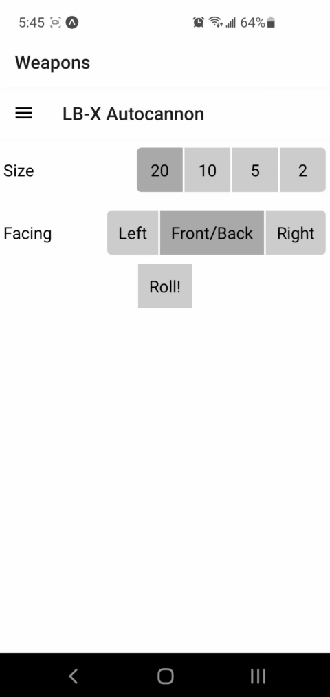
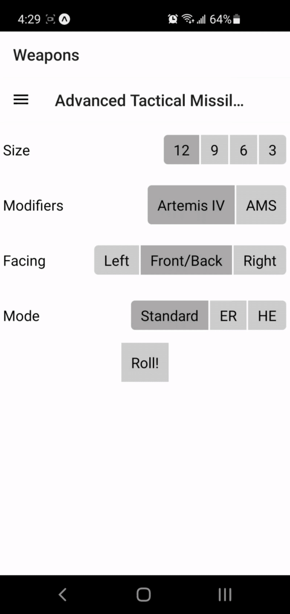

# lbx-helper

React Native app to help with the *annoying* parts of rolling clusters in Battletech:

* Number of cluster hits (including modifiers)
* Hit locations (including floating crits)

It won't do the *fun* parts:

* Rolling to hit
* Rolling criticals and locations

## Examples

### LB-X Autocannon

### Advanced Tactical Missiles

## Features

* Supports the following weapons:
    * LB-X autocannon
    * Long-Range Missiles (LRM)
    * Medium-Range Missiles (MRM)
    * Short-Range Missiles (SRM)
    * Advanced Tactical Missiles (ATM)
    * Rocket Launcher
    * Multi-Missile Launcher (MML)
    * Hyper-Assault Gauss Rifle
    * Silver Bullet Gauss Rifle
* Supports the following equipment that modifies cluster rolls:
    * NARC
    * Artemis IV/V FCS
    * Apollo FCS
    * AMS
* Optional settings
    * Floating crits
    * Confirm head hits (50% chance for head hit to instead hit center torso)

## TODO

* Vehicle locations
