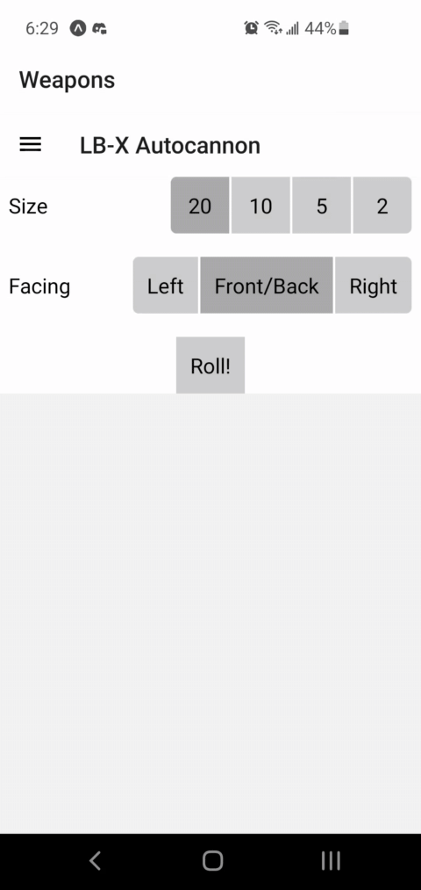

# lbx-helper

React Native app to help with rolling clusters in Battletech.

## Features

* Supports the following weapons:
    * LB-X autocannon
    * LRM
    * MRM
    * SRM
* Options
    * Floating crits
    * Confirm head hits (50% chance for head hit to instead hit center torso)

## TODO

* Artemis
* Hyper-Assault Gauss
* Re-roll individual rolls (e.g. to use Edge to re-roll a crit)
