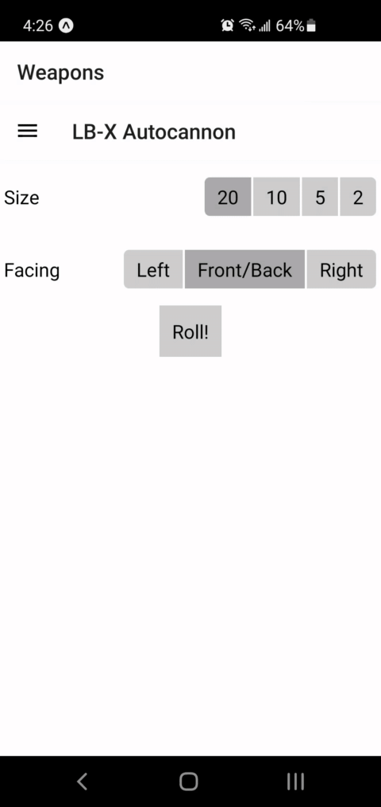

# lbx-helper

React Native app to help with rolling clusters in Battletech.

## Features

* Supports the following weapons:
    * LB-X autocannon
    * LRM
    * MRM
    * SRM
    * Hyper-Assault Gauss Rifle
    * Silver Bullet Gauss Rifle
* Supports the following equipment that modifies cluster rolls:
    * NARC
    * Artemis IV/V FCS
    * AMS
    * Apollo FCS
* Optional settings
    * Floating crits
    * Confirm head hits (50% chance for head hit to instead hit center torso)

## TODO

* More weapons
    * MML
    * ATM
* Vehicle locations
